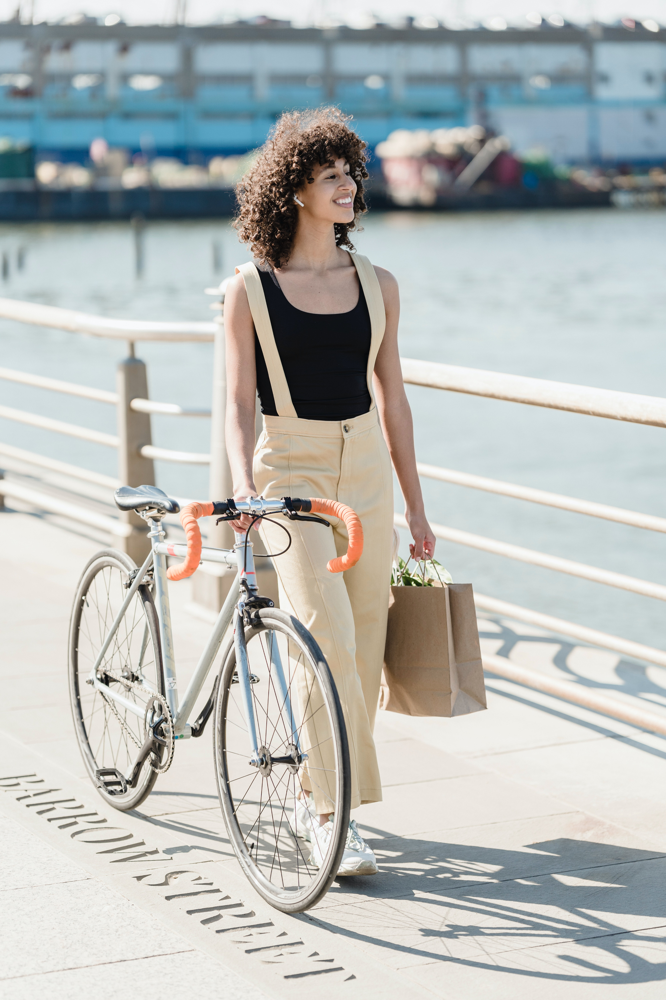

<!DOCTYPE html>
<html lang="en">
<head>
    <meta charset="UTF-8">
    <meta http-equiv="X-UA-Compatible" content="IE=edge">
    <meta name="viewport" content="width=device-width, initial-scale=1.0">
    <link rel="stylesheet" href="linkstylesheet.css" >
    <title>American Egale</title>
</head>
    
 

<body>
    

      <a href="#home" class="active">Home</a>
        <a href="#davidson">Harley Davidson</a>
        <a href="#Egale"class="active">American Egale</a>
        <a href="#Kawaski">Kawaski</a> 
        <a href="#contact">Contact</a>
        <a href="javascript:void(0);" class="icon" onclick="myFunction()">
          <i class="fa fa-bars"></i>
      

        </body>  
    
    

<h1> <strong>Specs</strong></h1>

    <ul>Carbon 29” hardtail frame, designed by Bart Brentjens</ul>
    <ul>Toray and Matrix T700/T800 carbon composite</ul>
    <ul>Race geometry, excels in climbing, cornering and accelerating</ul>
    <ul>Lightweight (950 grams for 17,5 inch size)</ul>
    <ul>27.2mm seatpost</ul>
   <ul>1 by only frame</ul>
    <ul>Boost (148mm) rear fork</ul>
    <ul>F30 bracket</ul>
    <ul>Internal cable routing</ul>
    <ul> 25 years of mountain-bike experience</ul>
    

</head>
<body>
  <footer> <a href="https://americaneagle.online" target="_blank"> </footer>
    </body>
    </html>
